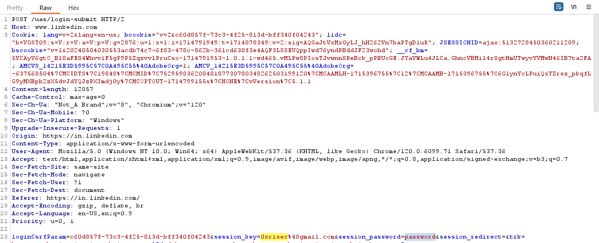

---
layout:
  title:
    visible: true
  description:
    visible: false
  tableOfContents:
    visible: true
  outline:
    visible: true
  pagination:
    visible: true
---

# How web application works?

Understanding the foundational technologies behind web applications is crucial for both using and hacking APIs. This includes knowledge of the HyperText Transfer Protocol (HTTP), authentication and authorization mechanisms, and common web server databases. Web applications operate on a client/server model, where the client (such as a web browser) requests resources from web servers. The interaction begins when a user enters a URL in their browser, initiating a request to the web server. The URL format is as follows:

## The URL

```
Protocol://hostname[:port number]/[path]/[?query][parameters]
```

### Protocol

Network protocols are essential for enabling communication between different devices over a network. They define the rules and conventions for data exchange. Here are some examples of network protocols:

#### 1. HTTP (Hypertext Transfer Protocol)

* **Purpose**: Used for transmitting web pages on the internet.
* **Example URL**: `http://www.example.com`
* **Real-World Use**: When you visit a website by entering a URL in your browser, your browser uses HTTP to request the web page from the server.

#### 2. HTTPS (Hypertext Transfer Protocol Secure)

* **Purpose**: A secure version of HTTP, using encryption (SSL/TLS) to secure the data.
* **Example URL**: `https://www.example.com`
* **Real-World Use**: When you log into your bank account online, HTTPS is used to securely transmit your login information and account details.

#### 3. FTP (File Transfer Protocol)

* **Purpose**: Used for transferring files between a client and a server on a network.
* **Example URL**: `ftp://ftp.example.com`
* **Real-World Use**: FTP is often used by web developers to upload files to their web hosting servers.

#### 4. SMTP (Simple Mail Transfer Protocol)

* **Purpose**: Used for sending emails.
* **Real-World Use**: When you send an email, your email client uses SMTP to send your message to the recipient's mail server.

#### 5. SSH (Secure Shell)

* **Purpose**: Used for secure remote login from one computer to another.
* **Example URL**: `ssh://example.com`
* **Real-World Use**: Developers and system administrators use SSH to securely access and manage servers remotely.

#### 6. WebSocket

* **Purpose**: Provides full-duplex communication channels over a single TCP connection.
* **Real-World Use**: Used in web applications to enable real-time communication between the client and server, such as in live chat applications and real-time notifications.

### Port

Ports specify the communication channel for network protocols. Common ports include `HTTP` on port `80`, `HTTPS` on port `443`, and `FTP` on port `21`. For nonstandard ports, include the port number in the URL, like `https://www.example.com:8443`. Ports `8080` and `8443` are often used for HTTP and HTTPS respectively.



### Path

The file directory path on the web server points to the location of the web pages and files specified in the URL. The path used in a URL is the same as a file path used to locate files on a computer.

### Query

A query is a part of a URL used for functionalities like searching or filtering, starting with a "?". It includes query parameters, like `lang=en`, to instruct the server on specific actions, such as language selection. Parameters are separated by "&". Web applications use queries for tracking and processing requests.

For example URL `https://www.google.com/search?q=JavaScript`, the query part is `q=JavaScript`. Here's a breakdown:

* The main URL or the base part is `https://www.google.com/search`.
* The query starts after the question mark `?`.
* `q` is the query parameter, which stands for "query" in this context, used by Google to specify the search term.
* `JavaScript` is the value assigned to the query parameter `q`, indicating what you are searching for on Google.

## HTTP Requests / HTTP Response

When an end user navigates to a URL using a web browser, the browser automatically generates an HTTP request for a resource. This resource is the information being requested—typically the files that make up a web page. The request is routed across the internet or network to the web server, where it is initially processed. If the request is properly formed, the web server passes the request to the web application.

The content provided below is a raw HTTP request, captured from a web application's network traffic, specifically from a login attempt to LinkedIn.

<figure><figcaption></figcaption></figure>

1. **Request Line**: `POST /uas/login-submit HTTP/2`
   * **Method**: `POST` - This indicates that the request is sending data to the server, typically used for updating or creating resources. In this context, it's likely sending login credentials.
   * **Request-URI**: `/uas/login-submit` - This is the resource on the server the request is targeting.&#x20;
   * **HTTP Version**: `HTTP/2` - This specifies the version of the HTTP protocol being used, indicating that this request is utilizing the newer, more efficient HTTP/2 protocol.
2. **Headers**:
   * **Host**: `www.linkedin.com` - This header specifies the domain name of the server (the host) to which the request is being sent.
   * **Cookie**: Contains session and tracking information, such as session identifiers and possibly authentication tokens, to maintain state with the server.
   * **Content-Type**: `application/x-www-form-urlencoded` - This indicates that the body of the request is formatted as a query string, typical for form submissions.
   * **User-Agent**: Provides information about the client making the request, including the operating system and browser version.
   * **Referer**: `https://www.linkedin.com/` - This header indicates the page from which the request originated, often used for analytics or security checks.
3. **Body**:
   * The body of the request contains the data being sent to the server. In this case, it's likely to include login credentials (`LoginCsr Parameter` and other parameters like `session key`, `session password`, etc.) and possibly other metadata required for the login process.&#x20;
4. **Miscellaneous**:
   * Other headers like `Accept`, `Sec-Fetch-*`, and `Accept-Encoding` provide additional information about the types of responses the client can understand, how the request was initiated, and what content encodings it can handle, respectively.

This request is a typical example of what happens "under the hood" when you log into a web application like LinkedIn. The client (browser) sends a `POST` request to the server with your login credentials and other necessary information. The server then processes this request, authenticates the user, and responds accordingly, usually redirecting the user to their profile page or showing an error message if the authentication fails.



## HTTP Status Code



## HTTP Methods



## Stateful and Stateless HTTP

HTTP (Hypertext Transfer Protocol) can operate in two modes: stateful and stateless.&#x20;

#### Stateless HTTP

HTTP is inherently a stateless protocol, meaning that each request from a client to a server is treated as an independent transaction that is unrelated to any previous request. This design allows the protocol to be simple and scalable. The server does not retain any state information between requests from the same client. As a result, each request must contain all the information necessary for the server to understand and process it, without relying on any stored context. This statelessness is a core feature of the HTTP protocol, enabling the vast scalability of the World Wide Web.

Advantages of statelessness include:

* **Simplicity**: Each request is processed independently, reducing server complexity.
* **Scalability**: Since the server does not need to maintain state information, it's easier to scale the system by adding more servers.
* **Reliability**: The failure of one request does not affect subsequent requests.

However, the stateless nature of HTTP makes it challenging to implement web applications that require user sessions or transactions spanning multiple requests.

#### Stateful HTTP

To overcome the limitations of statelessness, web applications often implement statefulness on top of HTTP. This is done using various techniques to maintain state information across multiple requests from the same client. Common methods include:

* **Cookies**: Small pieces of data stored by the client and sent with each request, allowing the server to recognize returning clients.
* **Session Tokens**: Unique identifiers sent by the client with each request, enabling the server to link the request to a session stored on the server.
* **Hidden Form Fields**: Data stored in forms and sent with requests, useful for maintaining state across form submissions.

Stateful HTTP allows web applications to offer more complex and user-specific interactions, such as shopping carts, user logins, and personalized content. However, implementing statefulness introduces complexity, as the server must manage and synchronize state information across requests and possibly across different servers.

Advantages of statefulness include:

* **Continuity**: Enables complex interactions and transactions that span multiple requests.
* **Personalization**: Allows for customized user experiences based on previous interactions.

The choice between stateful and stateless HTTP depends on the specific requirements of the web application. Stateless operations are preferred for simplicity and scalability, while stateful interactions are necessary for complex, user-centric web applications.

## Web Server Databases

### SQL databases: &#x20;

Structured Query Language (SQL) databases are relational databases in which the data is organized in tables. SQL databases include MySQL, Microsoft SQL Server, PostgreSQL, Oracle, and MariaDB, among others.

### NoSQL Databases:&#x20;

NoSQL databases, also known as distributed databases, are non-relational, meaning they don’t follow the structures of relational databases. Databases are typically open-source tools that handle unstructured data and store data as documents. NoSQL databases include  MongoDB, Couchbase, Cassandra, IBM Domino, Oracle NoSQL Database, Redis, and Elasticsearch, among others.

> If you would like additional resources about web applications, I highly suggest The Web Application Hackers Handbook (Wiley, 2011), Web Application Security (O’Reilly, 2020), Web Security for Developers (No Starch Press, 2020), and The Tangled Web (No Starch Press, 2011).

